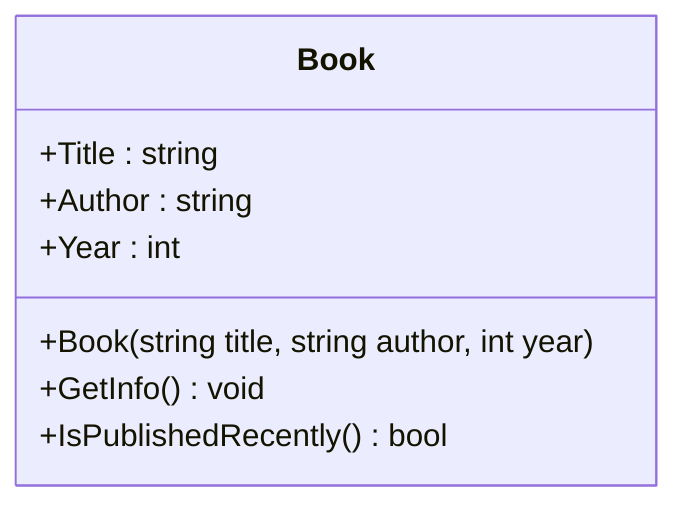
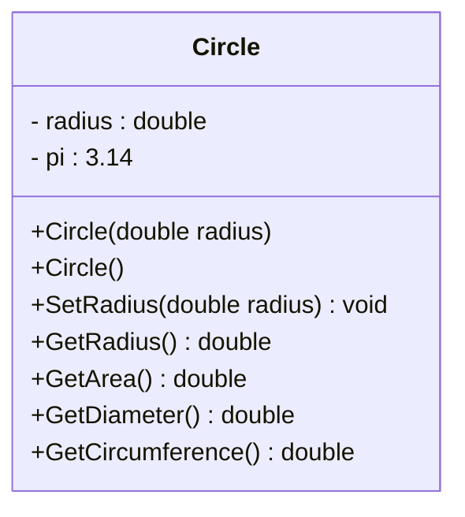
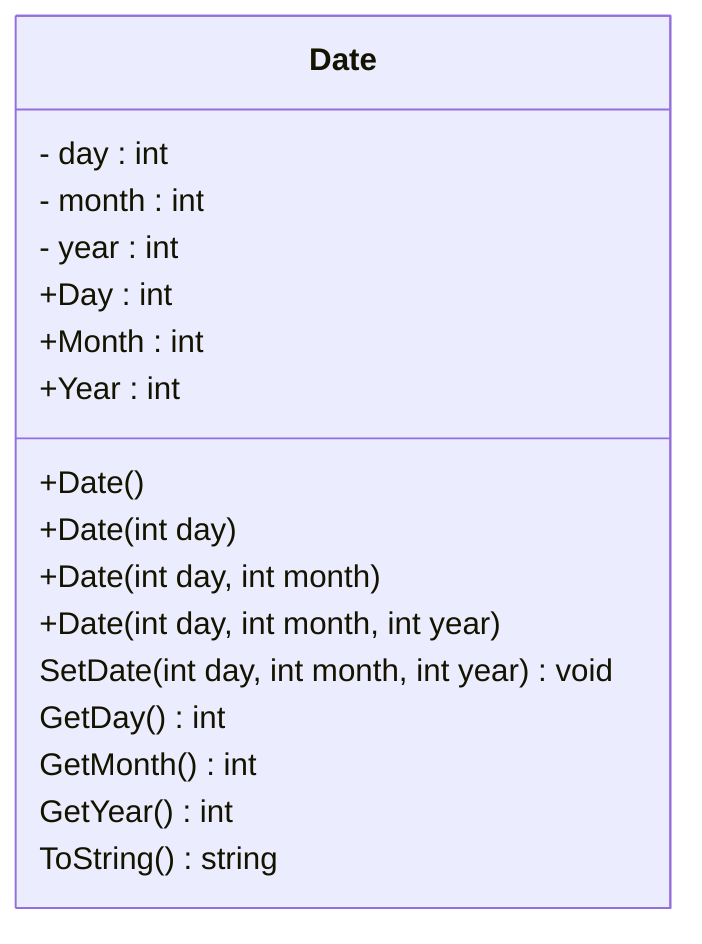
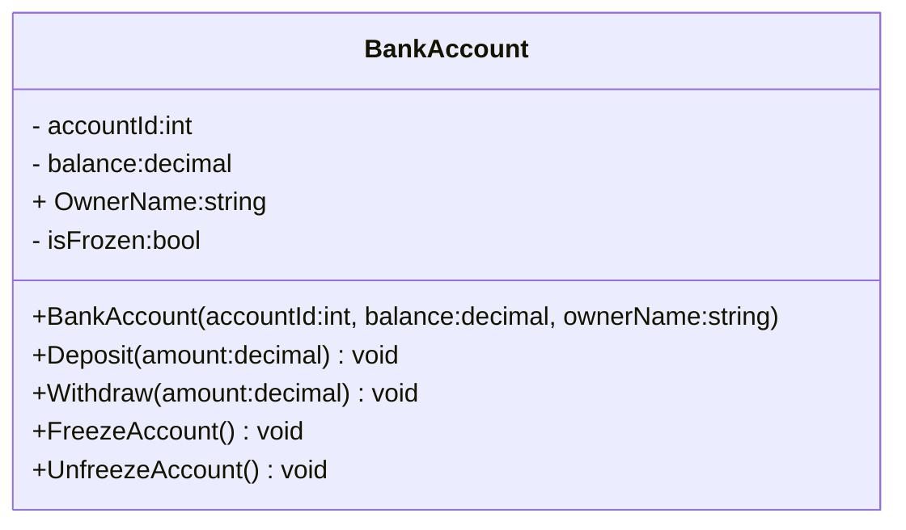

### Task 1 

Good luck with your task! 📚

Write a class called `Book` that represents a book with a title, author, and year of publication.

1. Create a public class called `Book`.

2. Create a constructor that takes parameters `title`, `author`, and `year` to initialize the object's properties.

3. Add a method called `GetInfo()` that will display information about the book in the format of a string.

4. Add a method called `IsPublishedRecently()` that will return `true` if the book was published after 2010, and `false` otherwise.

##

Напишите класс под названием `Book`, который представляет книгу с названием, автором и годом публикации.

1. Создайте общедоступный класс под названием `Book`.
 
2. Создайте конструктор, который принимает параметры `title`, `author` и `year` для инициализации свойств объекта.

3. Добавьте метод `GetInfo()`, который будет отображать информацию о книге в формате строки.


4. Добавьте метод `IsPublishedRecently()`, который будет возвращать `true`, если книга была опубликована после 2010 года, и `false` в противном случае.


---

### Task2

Create a `Circle` class that has the following fields:

- `radius`: a double
- `PI`: a double initialized with the value `3.14159`

The class should have the following methods and Constructors:

- `Constructor`: Accepts the radius of the circle as an argument.
- `Constructor`: A no-arg constructor that sets the `radius` field to `0.0`.
- `SetRadius`: A method for the `radius` field.
- `GetRadius`: A method for the `radius` field.
- `GetArea`: Returns the area of the circle, which is calculated as `area = PI * radius * radius`.
- `GetDiameter`: Returns the diameter of the circle, which is calculated as `diameter = radius * 2`.
- `GetCircumference`: Returns the circumference of the circle, which is calculated as `circumference = 2 * PI * radius`.

Write a program that demonstrates the `Circle` class by asking the user for the circle's radius,       
creating a `Circle` object, and then reporting the circle's area, diameter, and circumference.

##

Создайте класс `Circle`, который имеет следующие поля:

- `radius`: типа double
- `PI`: типа double и инициализировано значением `3.14159`

Класс должен иметь следующие методы и конструктори:

- `Constructor`: Принимает радиус окружности в качестве аргумента.
- `Constructor`: без аргументов устанавливает поле `radius` в значение `0.0`.
- `SetRadius`: Метод для поля `radius`.
- `GetRadius`: Метод для поля `radius`.
- `GetArea`: Возвращает площадь окружности, которая вычисляется по формуле `area = PI * radius * radius`.
- `GetDiameter`: Возвращает диаметр окружности, который вычисляется по формуле `diameter = radius * 2`.
- `GetCircumference`: Возвращает длину окружности, которая вычисляется по формуле `circumference = 2 * PI * radius`.

Напишите программу, которая демонстрирует класс `Circle`, запрашивая у пользователя радиус окружности, создавая объект `Circle`, а затем выводит площадь, диаметр и длину окружности.    


---

### Task 3

##
Класс `Date` моделирует календарную дату с днем, месяцем и годом.

- 3 частные переменные экземпляра: `day`, `month` и `year`.
- Конструкторы, публичные геттеры и сеттеры для частных переменных экземпляра.
- Метод `SetDate()`, который устанавливает день, месяц и год.
- Методы `GetMonth()`, `GetYear()` и `GetDay()` для получения соответствующих значений.
- Метод `ToString()`, который возвращает дату в формате `DD/MM/YYYY` с ведущим нулем для `DD` и `MM`, если применимо.

##

The `Date` class models a calendar date with day, month, and year.

#### Class Members

- 3 private instance variables: `day`, `month`, and `year`.
- Constructors, public getters, and setters for the private instance variables.
- `SetDate()` method that sets the day, month, and year.
- `GetMonth()`, `GetYear()`, and `GetDay()` methods to retrieve the respective values.
- `ToString()` method that returns the date in the format `DD/MM/YYYY` with leading zeros for `DD` and `MM`, if applicable.


**Input**
```
day : 1
month : 12
year : 2023
```
**Output**

```
01/12/2023
```
---

### Task 4

Let's say we have a task to create a simple system for managing bank accounts. Create a `BankAccount` class that has the following characteristics:

1. `accountId`(int): A unique account identifier that is assigned when the account is created and cannot be changed after that.
2. `balance`(decimal): The current account balance, which can only be changed using methods.
3. `OwnerName`(string): Account owner name.
4. `isFrozen`(bool): Flag indicating whether the account is frozen (no transactions allowed).
5. Methods `Deposit(amount:decimal)` and `Withdraw(amount:decimal)`: Two methods for depositing funds into an account and withdrawing funds from an account. Both methods must handle possible errors such as negative amounts, insufficient funds, and frozen accounts.
6. Method `FreezeAccount()`: Method for freezing an account.
7. Method `UnfreezeAccount()`: Method for unfreezing an account.

Your job is to implement this class and use it in your program to demonstrate the functionality.

##

Допустим, у нас есть задача по созданию простой системы управления счетами в банке. Создайте класс `BankAccount`, который имеет следующие характеристики:

1. `accountId`(int): Уникальный идентификатор счета, который присваивается при создании счета и не может быть изменен после этого.
2. `balance`(decimal): Текущий баланс счета, который можно изменять только с использованием методов.
3. `OwnerName`(string): Имя владельца счета.
4. `isFrozen`(bool): Флаг, указывающий, заморожен ли счет (нельзя проводить операции).
5. Методы `Deposit(amount:decimal)` и `Withdraw(amount:decimal)`: Два метода для внесения средств на счет и снятия средств со счета. Оба метода должны обрабатывать возможные ошибки, такие как отрицательные суммы, недостаточно средств и замороженные счета.
6. Метод `FreezeAccount()`: Метод для заморозки счета.
7. Метод `UnfreezeAccount()`: Метод для разморозки счета.

Ваша задача - реализовать этот класс и использовать его в программе для демонстрации функциональности.



// Пример использования класса BankAccount
BankAccount account = new BankAccount(1001, "John Doe", 5000.00m);

// Внесение и снятие средств, заморозка и разморозка счета
account.Deposit(1000.00m);
account.Withdraw(200.00m);

account.FreezeAccount();
account.Deposit(500.00m); // Не должно выполниться из-за замороженного счета

account.UnfreezeAccount();
account.Deposit(500.00m); // Должно выполниться после разморозки счета

Console.ReadKey();
```
